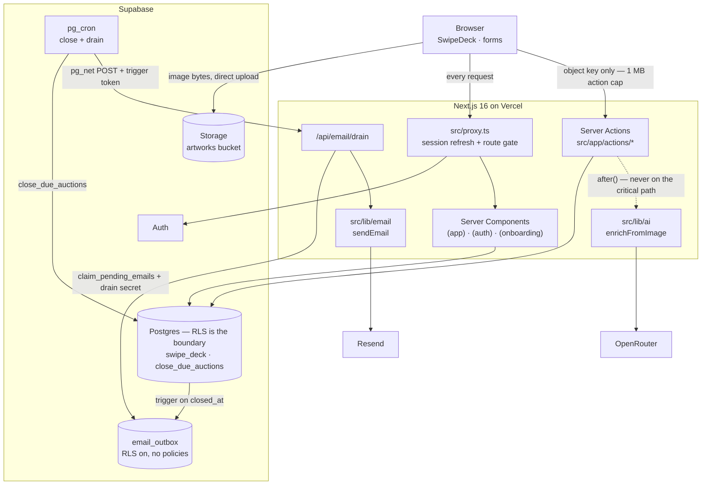

# ArtSwipe

A discovery engine for art. A collector signs up, names a couple of styles they
like, and starts swiping; every like feeds a taste profile, and the deck
reorders itself around it. On top of that engine sits the rest of a product —
artists upload and manage their own work, AI enrichment tags it, and any piece
can be put up for a sealed-bid auction that closes on a schedule and hands the
winner and the seller each other's contact details.

Built as a certification project for 10xDevs 4.0, entirely through an
AI-assisted workflow: 19 pull requests, 28 migrations, and 14 planned changes,
each with its own research, plan and review under [`context/`](context/). The
[delivery story](docs/delivery-story.md) is the narrative version of that.

---

## The two loops

**The collector loop.** Sign up → pick two to four style terms → a starter deck
drawn from those styles → like five pieces → hand-off to
[`/discover`](src/app/%28app%29/discover/page.tsx), where the deck is ordered by
how much each artwork's tags overlap the union of tags on everything you have
liked so far. Skips are a demotion signal, never taste input — a piece you
skipped comes back, just far down. The whole ranking is one SQL function,
[`swipe_deck`](supabase/migrations/20260910180000_rank_swipe_deck.sql), so the
ordering is computed where the data lives and is the same for the app, the
tests, and psql.

**The auction loop.** An artist lists a published piece with a starting price
and a 1-, 3- or 7-day duration. Everyone who has liked that piece gets an email
about it (with a working unsubscribe link that needs no session). Collectors
place **sealed** bids — you can see that an auction has bids, never what they
are, because RLS only returns your own. A `pg_cron` job closes auctions whose
deadline has passed, picks the winner deterministically, and enqueues the four
outcome emails: won, sold, lost, unsold. The won and sold messages carry the
contact exchange — this is where the marketplace ends and two people talk
directly.

---

## Architecture



### Load-bearing decisions

| Decision                                                                        | Why                                                                                                                                                                                                                                                                                                                                                     |
| ------------------------------------------------------------------------------- | ------------------------------------------------------------------------------------------------------------------------------------------------------------------------------------------------------------------------------------------------------------------------------------------------------------------------------------------------------- |
| **RLS is the security boundary; ownership filters in queries are not.**         | Every table carries policies, and a query's `eq("artist_id", user.id)` exists for correctness and index selectivity only. Removing one must never expose a row. See any migration under [`supabase/migrations/`](supabase/migrations/).                                                                                                                 |
| **Images go browser → Storage; only the object key travels through an action.** | Server Action bodies are capped at 1 MB, well under a real photograph. [`src/lib/artworks/upload.ts`](src/lib/artworks/upload.ts) uploads client-side and hands the action a key.                                                                                                                                                                       |
| **AI enrichment never throws and never blocks a mutation.**                     | [`enrichFromImage`](src/lib/ai/enrich.ts) returns `{ ok: false, reason }`; with `OPENROUTER_API_KEY` unset it degrades to unavailable and upload still works. The publish-time top-up runs after the row is written.                                                                                                                                    |
| **Ranking is tag overlap in SQL, not an embedding.**                            | The original plan called for a vector column. Tag overlap over the enriched taxonomy discriminates well enough on this corpus, is explainable, and needs no extension — [`rank_swipe_deck.sql`](supabase/migrations/20260910180000_rank_swipe_deck.sql).                                                                                                |
| **Exactly one outbound-email path.**                                            | Everything funnels through [`sendEmail`](src/lib/email/send.ts), which never throws and returns a closed failure union. A second send path is the thing that makes delivery unauditable.                                                                                                                                                                |
| **Postgres cannot call Node, so there is a bridge.**                            | The auction close runs under `pg_cron`. A trigger writes `email_outbox` rows; a per-minute job `pg_net`-POSTs [`/api/email/drain`](src/app/api/email/drain/route.ts), which composes and sends them.                                                                                                                                                    |
| **The drain's two secrets are deliberately different values.**                  | `pg_net` persists its request into `net.http_request_queue`, whose ACL grants `PUBLIC` everything and which this project cannot revoke. So the header token only asks for a drain; the secret that unlocks addresses never travels over that hop — [`split_drain_trigger_token.sql`](supabase/migrations/20260913120300_split_drain_trigger_token.sql). |
| **The unsubscribe GET renders; only the POST mutates.**                         | Link scanners prefetch every URL in a message. A mutating GET would opt people out silently — indistinguishable from the feature working.                                                                                                                                                                                                               |
| **`email_sends` and `email_outbox` have RLS on and no policies at all.**        | The absence _is_ the access control: both hold plaintext addresses, including a counterparty's. They are reached only through `security definer` functions gated by a Vault secret.                                                                                                                                                                     |

Longer versions of each, with the incident or review that produced them, are in
the [delivery story](docs/delivery-story.md). The rules an agent must follow
when editing this repo are in [`AGENTS.md`](AGENTS.md).

---

## Certification requirements mapping

The six criteria from [`PROJECT_PLAN.md`](PROJECT_PLAN.md), and where each one
is actually demonstrated.

| Requirement                | Where it is met                                                                                                                                                                                                                                                                                                                                                    |
| -------------------------- | ------------------------------------------------------------------------------------------------------------------------------------------------------------------------------------------------------------------------------------------------------------------------------------------------------------------------------------------------------------------ |
| **Access control**         | Supabase Auth for credentials; [`src/proxy.ts`](src/proxy.ts) + [`src/utils/supabase/proxy.ts`](src/utils/supabase/proxy.ts) for session refresh and route gating; RLS policies in every migration for the actual boundary. Proven against a real stack by `npm run test:integration`.                                                                             |
| **Data management (CRUD)** | Artworks (artist studio: create, edit, publish, delete), interactions, auctions, bids, profiles and notification preferences — all mutations through Server Actions in [`src/app/actions/`](src/app/actions/), all input Zod-validated at the boundary.                                                                                                            |
| **Business logic**         | Two real domain decisions, neither of them a stored record: per-collector deck ranking in [`swipe_deck`](supabase/migrations/20260910180000_rank_swipe_deck.sql), and deterministic auction resolution in [`close_due_auctions`](supabase/migrations/20260912120000_add_auction_close.sql). Plus vision-model enrichment on upload ([`src/lib/ai/`](src/lib/ai/)). |
| **Project artifacts**      | [`PROJECT_PLAN.md`](PROJECT_PLAN.md), three PRD generations and three roadmaps in [`context/foundation/`](context/foundation/), a [test plan](context/foundation/test-plan.md), and 14 archived changes in [`context/archive/`](context/archive/) each carrying research, a plan and a review.                                                                     |
| **User-perspective test**  | [`test/e2e/taste-loop.spec.ts`](test/e2e/taste-loop.spec.ts) — a real browser signs a collector up, walks onboarding, likes five pieces, and asserts the next deck is ordered toward those likes. Nothing mocked. Run it with `npm run test:e2e`.                                                                                                                  |
| **CI/CD pipeline**         | [`.github/workflows/verify.yml`](.github/workflows/verify.yml) runs format → lint → typecheck → test → build on every PR and push to `main`; [`.github/workflows/migrations.yml`](.github/workflows/migrations.yml) auto-deploys migrations merged to `main`; Vercel deploys the app.                                                                              |

---

## Getting started

Prerequisites: [Node 24](.nvmrc) (`nvm use`), Docker or Podman for the local
Supabase stack.

```bash
nvm use
npm ci

npx supabase start        # local Postgres, Auth, Storage, Studio
cp .env.example .env.local # then fill in the two NEXT_PUBLIC_ values from `npx supabase status`

npm run db:seed:fetch     # ONE TIME after a clone — downloads ~260 MB of corpus images
npm run db:reset          # applies all migrations, seeds the corpus, uploads the images

npm run dev               # http://localhost:3000
```

Every environment variable is documented inline in
[`.env.example`](.env.example) — what it does, whether it is optional, and what
breaks if it is missing. Only the two `NEXT_PUBLIC_SUPABASE_*` values are
required; AI enrichment and outbound email each degrade cleanly to "off" when
their key is unset.

The seed corpus is 1000 public-domain artworks from the Art Institute of
Chicago. Its manifest, the fetch/enrich/generate pipeline, and the Vault
entries a local reset clears are all covered in
[`supabase/seed-assets/README.md`](supabase/seed-assets/README.md).

---

## Testing

Four lanes, each with its own config and its own file glob, so one can never
pick up another's specs. Only the first runs in CI.

| Lane            | Command                    | Config                                                           | Glob                           | What it owns                                                                            | CI  |
| --------------- | -------------------------- | ---------------------------------------------------------------- | ------------------------------ | --------------------------------------------------------------------------------------- | --- |
| **Default**     | `npm run test`             | [`vitest.config.mts`](vitest.config.mts)                         | `test/**/*.test.ts`            | Zod gates and happy paths over Server Actions and `src/lib`, Supabase fully mocked      | ✅  |
| **Integration** | `npm run test:integration` | [`vitest.integration.config.mts`](vitest.integration.config.mts) | `test/integration/**/*.int.ts` | Real Postgres, Storage, Auth and RLS — the questions mocking cannot answer              | ❌  |
| **Smoke**       | `npm run test:smoke`       | [`vitest.smoke.config.mts`](vitest.smoke.config.mts)             | `test/smoke/**/*.live.ts`      | One real call per external provider (OpenRouter, Resend), for confirming an integration | ❌  |
| **E2E**         | `npm run test:e2e`         | [`playwright.config.ts`](playwright.config.ts)                   | `test/e2e/**/*.spec.ts`        | One risk: the collector's taste loop, end to end in a real browser                      | ❌  |

The three opt-in lanes all run against a **local** stack and refuse to start
against anything else — `.env.local` points at production, and they create
users. Credentials for the integration and E2E lanes come from
`.env.test.local`, which you generate yourself:

```bash
npx supabase start
npx supabase status -o env --override-name api.url=NEXT_PUBLIC_SUPABASE_URL \
  --override-name auth.anon_key=NEXT_PUBLIC_SUPABASE_PUBLISHABLE_KEY > .env.test.local
```

The E2E lane additionally needs `npx playwright install chromium` once, a seeded
corpus, and patience: its `webServer` runs a full `npm run build` before the
first test, because headless Chromium does not hydrate `next dev` pages
reliably here.

Before calling any change done, run the same gate CI runs:

```bash
npm run format:check && npm run lint && npm run typecheck && npm run test && npm run build
```

---

## Project layout

```
src/
├── app/
│   ├── (app)/          # authenticated — discover, liked, studio, auctions, account
│   ├── (auth)/         # login, signup — signed-out only
│   ├── (onboarding)/   # style picker + starter deck, one route, two states
│   ├── actions/        # Server Actions by domain; every mutation goes through one
│   ├── api/email/drain # the pg_cron → Node bridge
│   └── unsubscribe/    # public, session-free, GET renders and POST mutates
├── components/         # by domain: artworks, auctions, auth, account, onboarding, ui
├── lib/                # data access and pure logic: ai, artworks, auctions, email, ...
├── types/              # database.ts is GENERATED; domain.ts is hand-written
├── utils/supabase/     # client / server / proxy factories — pick the right one
└── proxy.ts            # Next 16's name for middleware

supabase/migrations/    # 28 migrations, applied in timestamp order
test/                   # four lanes, four globs
context/                # the /10x-* workflow: foundation docs, changes, archive
```

## Further reading

- [`AGENTS.md`](AGENTS.md) — the rules for editing this repo, human or agent.
  Dense and prescriptive; read it before changing anything.
- [`docs/delivery-story.md`](docs/delivery-story.md) — how the product was
  built: the three PRD generations, all 14 changes in order, and what went
  wrong.
- [`PROJECT_PLAN.md`](PROJECT_PLAN.md) — the founding document, reconciled with
  what shipped, with its decision log intact.
- [`context/foundation/`](context/foundation/) — PRDs, roadmaps, the test plan,
  the stack assessment, and the accepted [lessons](context/foundation/lessons.md).
- [`supabase/seed-assets/README.md`](supabase/seed-assets/README.md) — the
  corpus and seed workflow, including `npm run db:push`.
